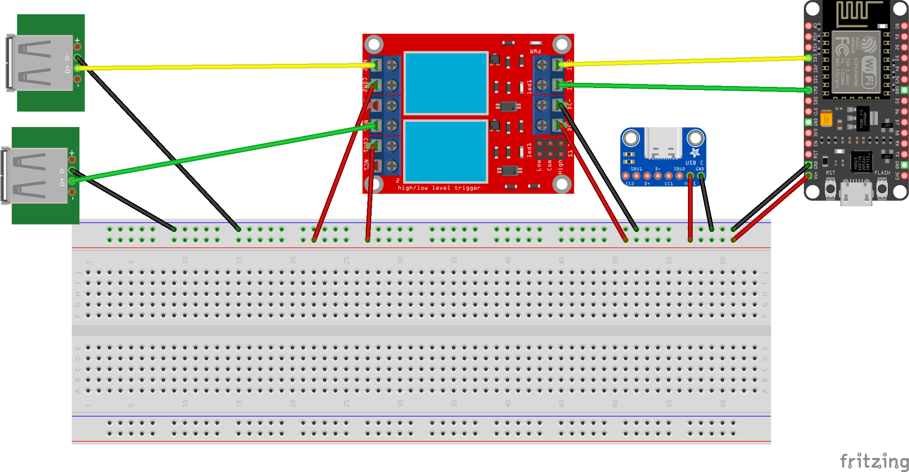

# HAIUC
## Home Assistant Integrated USB Controller
This project is a 5V dual USB fan controller powered by an ESP32 and integrated into Home Assistant using ESPHome. It allows you to intelligently control two separate USB fans based on any trigger available in Home Assistant.

The project includes the ESPHome configuration and a custom-designed 3D printable enclosure to house all the components neatly.


### Features
- Controls two 5V USB fans independently.
- Seamless integration with Home Assistant as two separate switches.
- Powered by a single USB-C input for a clean setup.
- Uses a reliable 2-channel relay module to safely handle fan current.
- Custom 3D printed enclosure that you can print at home.

### Hardware Requirements
- Microcontroller: 1x ESP32 Development Board (e.g., NodeMCU-32S, ESP32-DevKitC)
- Relay Module: 1x 2-Channel 5V Relay Module (opto-isolated, 3.3V logic compatible)
- Power Input: 1x USB-C 2-pin Breakout Board
- Fan Outputs: 2x USB-A Female Breakout Boards
- Power Supply: 1x External USB-C Power Supply (must be rated for 5V 2A or more)
- Fans: 2x Standard 5V USB Fans
- Wiring: Assorted DuPont Jumper Wires (M-F, F-F)

### Bill of Materials (Affiliate links)
- [ESP32 Development Board](https://s.click.aliexpress.com/e/_oCf633y)
- [Relay module](https://s.click.aliexpress.com/e/_omhch7G)
- [Power input](https://s.click.aliexpress.com/e/_on5gas6)
- [Usb output](https://s.click.aliexpress.com/e/_op9ed0Q)
- [Fans](https://s.click.aliexpress.com/e/_oocz39C)
- [Wires](https://s.click.aliexpress.com/e/_o2FBRIE)
- [M3 threaded inserts](https://s.click.aliexpress.com/e/_opVAM3s)


## Wiring & Assembly
The circuit is designed to be straightforward. The main USB-C port provides 5V power to the entire system, which the relay module then switches to power the fans.



#### 1. Power Distribution (from USB-C Input):
- The +5V (VBUS) pin from the USB-C input is distributed to:
    - The VIN or 5V pin on the ESP32.
    - The VCC and JD-VCC pins on the relay module (keep the jumper on).
    - The COM (Common) terminal of both relays.

- The GND pin from the USB-C input is connected to a common ground rail, which connects to:
    - A GND pin on the ESP32.
    - The GND pin on the relay module.
    - The GND pins on both USB-A female output boards.

#### 2. Control Signals (ESP32 to Relay):
- ESP32 GPIO21 -> Relay Module IN1
- ESP32 GPIO22 -> Relay Module IN2

#### 3. Fan Outputs:
- Relay 1 NO (Normally Open) -> +5V (VBUS) pin on the first USB-A output board.
- Relay 2 NO (Normally Open) -> +5V (VBUS) pin on the second USB-A output board.

## Software & Configuration
This project uses ESPHome to create the firmware, making integration with Home Assistant incredibly simple.

Below is the complete `yaml` configuration. Copy this code into your device's configuration file in ESPHome or download it from the [release tab](https://github.com/tiwiz/haiuc/releases/latest).

```YAML
esphome:
  name: haiuc

esp32:
  board: nodemcu-32s #Replace with another board if different
wifi:
  ssid: "your ssid goes here"
  password: "AndSoDoesYourPassword"
  ap:

# Enable Home Assistant API
api:

# Enable OTA updates
ota:
  platform: esphome

# Enable debug logger
logger:

switch:
  - platform: gpio
    name: "Fan 0" # Change here to switch the name that appears in Home Assistant
    id: fan_0  
    pin: GPIO21             # GPIO pin connected to
    # inverted: true        # Uncomment this line IF the relay turns on when the GPIO is LOW (0V) and turns off when it is HIGH (3.3V). Try without it first.

  - platform: gpio
    name: "Ventola 1"    
    id: fan_1 
    pin: GPIO22             
    # inverted: true  
```

### Setup

1. Open the ESPHome dashboard in Home Assistant.
2. Create a new device and paste the code above into its configuration.
3. Modify the `wifi` section with your network details.
4. Click *Install* and flash the firmware to your ESP32 (via USB for the first time).

### Home Assistant Integration
Once the device is flashed and connected to your Wi-Fi, Home Assistant will automatically discover it.
1. Go to Settings -> Devices & Services.
2. You should see a new device discovered. Click Configure.
3. The two switches ("Desk Fan" and "Rack Fan") will be added to Home Assistant and are ready for your automations!

## 3D Printed Enclosure
A custom-designed enclosure is available to house all the components for a clean and professional finish. The case is designed with appropriate cutouts for the USB-C power input and the two USB-A fan outputs, plus the hole thight enough for M3 threaded soldering inserts.

You can download the related files from [Makerworld](https://makerworld.com/en/models/1594744-home-assistant-integrated-dual-fan-controller-box#profileId-1679925) or from this [repository](./box/box_stl_v1.zip).

## License
```
MIT License

Copyright (c) 2025 Roberto Orgiu

Permission is hereby granted, free of charge, to any person obtaining a copy
of this software and associated documentation files (the "Software"), to deal
in the Software without restriction, including without limitation the rights
to use, copy, modify, merge, publish, distribute, sublicense, and/or sell
copies of the Software, and to permit persons to whom the Software is
furnished to do so, subject to the following conditions:

The above copyright notice and this permission notice shall be included in all
copies or substantial portions of the Software.

THE SOFTWARE IS PROVIDED "AS IS", WITHOUT WARRANTY OF ANY KIND, EXPRESS OR
IMPLIED, INCLUDING BUT NOT LIMITED TO THE WARRANTIES OF MERCHANTABILITY,
FITNESS FOR A PARTICULAR PURPOSE AND NONINFRINGEMENT. IN NO EVENT SHALL THE
AUTHORS OR COPYRIGHT HOLDERS BE LIABLE FOR ANY CLAIM, DAMAGES OR OTHER
LIABILITY, WHETHER IN AN ACTION OF CONTRACT, TORT OR OTHERWISE, ARISING FROM,
OUT OF OR IN CONNECTION WITH THE SOFTWARE OR THE USE OR OTHER DEALINGS IN THE
SOFTWARE.
```

## Support the development

[](https://buymeacoffee.com/tiwiz)